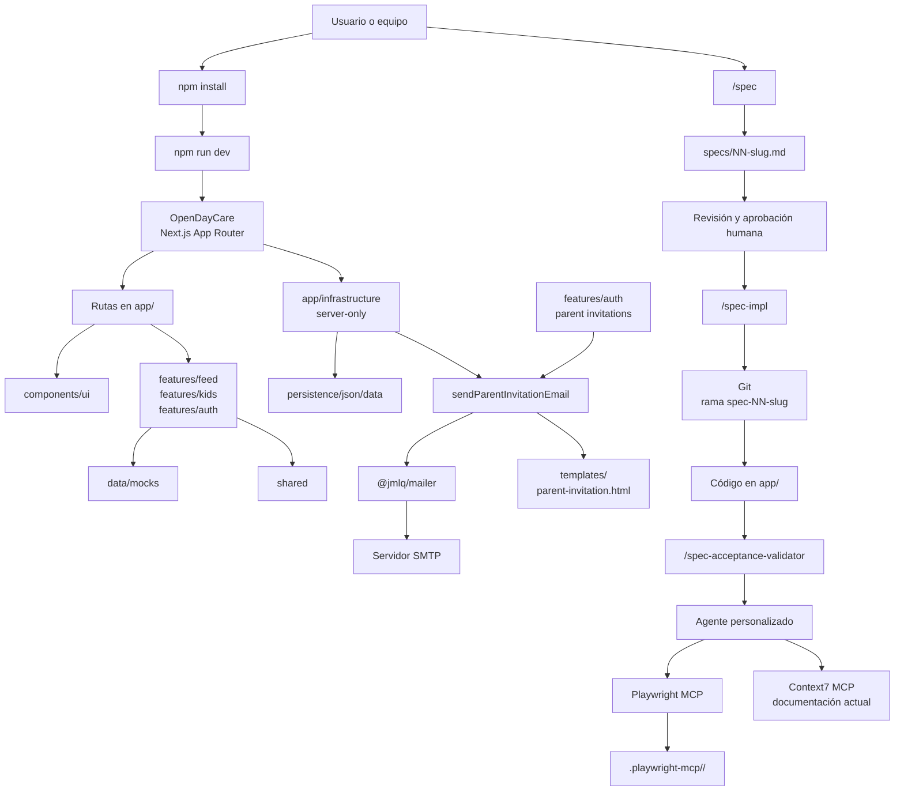
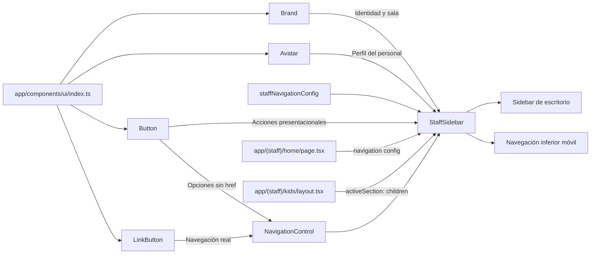

# OpenDayCare

OpenDayCare es un prototipo frontend para la gestión de una guardería ficticia,
`Sala Soles`. Este repositorio también funciona como laboratorio de desarrollo
asistido por agentes, MCPs y **Spec Driven Development (SDD)**.

La aplicación se construye a partir de especificaciones versionadas, skills
reutilizables y validaciones realizadas por agentes. La interfaz actual incluye
un feed de personal, el listado de niños y sus perfiles, la vinculación de
padres mediante invitaciones y datos persistidos en JSON tipados.

## Stack

- Next.js `16.3.5` con App Router.
- React `19.2.8`.
- TypeScript estricto.
- Tailwind CSS `4` y CSS Modules.
- Fredoka y Nunito mediante `next/font/google`.
- npm como gestor de paquetes.
- Alias `@/*` apuntando a la raíz del proyecto.

## Instalación y ejecución

Requiere una versión de Node.js compatible con Next.js 16. Después, instala las
dependencias y arranca el servidor:

```bash
npm install
npm run dev
```

Abre [http://localhost:3000](http://localhost:3000).

Comandos disponibles:

| Comando | Uso |
| --- | --- |
| `npm run dev` | Servidor de desarrollo |
| `npm run build` | Build de producción |
| `npm run start` | Servidor con el build generado |
| `npm run lint` | Ejecución de ESLint |

## Configuración de correo

La integración con `@jmlq/mailer` es exclusivamente server-only y se expone a
la aplicación mediante `@/app/infrastructure`. Next.js carga las variables desde
los archivos `.env*`; la aplicación no inicializa `dotenv` por separado.

Define la configuración SMTP en un archivo local ignorado por Git, por ejemplo
`.env.local`, usando `.env.template` como referencia:

```dotenv
APP_URL=http://localhost:3000

MAILER_EMAIL=example@gmail.com
MAILER_SECRET_KEY=app_password_here
MAILER_FROM=example@gmail.com

MAIL_HOST=smtp.gmail.com
MAIL_PORT=587
MAIL_SECURE=false

MAIL_TEMPLATE_PATH=templates
MAIL_TEMPLATE_EXTENSION=html
```

`MAIL_PORT` debe ser un entero positivo y `MAIL_SECURE` acepta únicamente
`true` o `false`. `MAIL_TEMPLATE_PATH` se resuelve desde el directorio de trabajo
del proyecto; por tanto, `templates` apunta a la carpeta raíz `templates/`.
`APP_URL` debe ser un origen absoluto HTTP o HTTPS y se utiliza para construir
los enlaces de activación sin depender de cabeceras de petición.

Las variables del mailer se validan al solicitarlo por primera vez. Las variables
de autenticación se validan al cargar la configuración de NextAuth, por lo que
deben estar presentes también durante el build. Una configuración ausente o
inválida falla con un error explícito. Las credenciales reales nunca se
versionan: `.gitignore` permite únicamente el archivo de ejemplo `.env.template`.

La plantilla `templates/parent-invitation.html` forma parte de los archivos
necesarios en runtime. Un despliegue que empaquete solo el output de Next.js,
como `output: "standalone"`, debe incluir también la carpeta `templates/`.

## Rutas actuales

- `/home`: feed del personal de Sala Soles.
- `/`: redirect permanente a `/home`.
- `/auth/login`: inicio de sesión.
- `/auth/activate-account`: activación de cuenta; acepta `?code=<valor>`.
- `/auth/link-parent?kidId=<id>`: formulario protegido para invitar a otro padre
  desde un perfil de niño.
- `/api/auth/[...nextauth]`: Route Handler de NextAuth v4 para credenciales y sesiones JWT.
- `/kids`: listado de ocho niños con búsqueda local y badges de alergias.
- `/kids/[slug]`: perfil de un niño con información básica, notas médicas y padres vinculados.
- `/kids/edit/[id]`: edición de un niño por ID.
- `/login`, `/activate-account` y `/kids/:id/edit`: redirects permanentes a sus nuevas rutas.
- `/kids/[slug]` con un slug desconocido: página 404 propia.

### Invitaciones de padres

El personal con rol `personal` puede crear invitaciones desde “Vincular otro
padre” en `/kids/[slug]`. El servidor valida nombre, email y parentesco, genera
un código criptográficamente aleatorio de ocho caracteres sin símbolos ambiguos
y fija un vencimiento de siete días. La persona se crea como `parent/pending` y
la invitación se persiste bajo transacción JSON antes de contactar al mailer;
no se crea `ParentKid` durante este flujo.

Los fallos SMTP conservan los registros pendientes y muestran un error
recuperable. Un reintento de una invitación pendiente sin envío confirmado
reutiliza el código vigente o rota código y vencimiento si ya expiró. Los
envíos exitosos actualizan `sentAt` y redirigen al perfil con
`?invitation=sent`. Los padres autenticados son redirigidos a `/home`.

## Autenticación

La autenticación usa `next-auth@4.24.15` con Credentials Provider, sesiones JWT
de siete días y cookies HttpOnly. La configuración server-only vive en `auth.ts`
y obtiene sus valores desde `app/shared/config/server/environment.ts`.

Añade estas variables a tu archivo local `.env` o `.env.local`, usando
`.env.template` como referencia:

```dotenv
AUTH_SECRET=replace_with_a_random_secret
AUTH_SESSION_MAX_AGE_SECONDS=604800
AUTH_SESSION_COOKIE_NAME=next-auth.session-token
AUTH_SESSION_COOKIE_HTTP_ONLY=true
AUTH_SESSION_COOKIE_SECURE=false
AUTH_SESSION_COOKIE_SAME_SITE=lax
AUTH_SESSION_COOKIE_PATH=/
AUTH_SIGN_IN_PATH=/auth/login
```

`AUTH_SECRET` debe reemplazarse por un secreto aleatorio real fuera del entorno
local. `AUTH_SESSION_COOKIE_SECURE` debe ser `true` cuando la aplicación se sirve
exclusivamente sobre HTTPS.

El personal con rol `personal` puede acceder a `/kids/**` y conserva el feed de
personal en `/home`. Los padres con rol `parent` reciben un estado familiar
seguro en `/home` y no pueden acceder a las rutas de Kids. Las personas
inexistentes, inactivas o con un rol cambiado son expulsadas de la sesión.

### Credenciales demo

Estas credenciales existen únicamente para pruebas locales del prototipo:

| Usuario | Email | Password | Rol |
| --- | --- | --- | --- |
| Caro Giménez | `caro@opendaycare.com` | `OpenDayCare1!` | `personal` |

Los demás hashes `mock-hash-*` de los fixtures no son contraseñas válidas.
No reutilices la clave demo ni agregues credenciales reales al repositorio.

## Arquitectura

La aplicación sigue una organización **feature-first**:

```text
open-daycare/
├── auth.ts                    Configuración server-only de NextAuth v4
├── types/                     Ampliaciones TypeScript de NextAuth
├── app/
│   ├── (staff)/              Rutas de personal sin segmento público
│   │   ├── home/             Feed en `/home`
│   │   └── kids/             Listado, perfil y edición de Kids
│   ├── auth/                 Rutas públicas de autenticación
│   ├── components/           UI reutilizable y layout de aplicación
│   │   ├── layout/            StaffSidebar y navegación
│   │   └── ui/                Componentes visuales reutilizables
│   ├── data/mocks/            Fixtures estáticos no editables
│   ├── features/
│   │   ├── auth/              Componentes, acciones y contratos de Auth
│   │   ├── family/            Relaciones familiares
│   │   ├── feed/              Componentes y tipos del feed
│   │   ├── kids/              Listado, perfiles y tipos de niños
│   │   ├── people/            Personas
│   │   └── rooms/             Salas
│   ├── infrastructure/
│   │   ├── adapters/jmlq/     Integraciones server-only con paquetes JMLQ
│   │   └── persistence/json/  Adapter, transacciones y datos JSON editables
│   └── shared/                Utilidades y configuración transversal
├── templates/               Plantillas HTML requeridas en runtime
├── specs/                   Contratos funcionales versionados
├── .agents/skills/          Skills del flujo SDD
├── .opencode/               Agentes y comandos personalizados
├── references/              Prototipos HTML y capturas visuales
└── .playwright-mcp/         Evidencia de validaciones visuales
```

Los modelos de dominio viven en `app/features/<domain>/types/`. Los fixtures
estáticos viven en `app/data/mocks/` y sus APIs públicas se exponen mediante
`index.ts`. Los cuatro JSON editables viven en
`app/infrastructure/persistence/json/data/` y solo se acceden mediante el
adapter server-only. Las features exponen barrels públicos; sus operaciones de
servidor se consumen desde entradas `server` explícitas. Los componentes de
cliente reciben DTOs mínimos proyectados por el servidor.

### Diagrama del laboratorio



## ¿Qué es una spec?

Una **spec** es el contrato que describe una funcionalidad antes de escribir su
código. Define el objetivo, alcance, modelo de datos, plan de implementación,
criterios de aceptación, decisiones y riesgos.

Las specs se almacenan en `specs/` con el formato `NN-slug.md`. Sus estados son:

1. `Draft`: definición inicial.
2. `In review`: revisión del contenido.
3. `Approved`: lista para implementación.
4. `Implement`: implementación realizada y aceptación en validación.
5. `Implemented`: implementación y aceptación completadas.
6. `Obsolete`: reemplazada o descartada.

Specs existentes:

| Spec | Estado | Resultado |
| --- | --- | --- |
| `01-home-feed.md` | `Implemented` | Feed responsive en `/` |
| `02-shared-ui-and-mocks.md` | `Implemented` | UI reutilizable y mocks centralizados |
| `03-kids-and-profiles.md` | `Implemented` | Listado, perfiles, búsqueda y 404 de Kids |
| `04-kid-allergy-tags.md` | `Implemented` | Badges de alergias y proyección segura |
| `05-account-activation-and-login.md` | `Approved` | Login, activación y modelos de identidad |
| `09-account-activation-session-and-login.md` | `Implemented` | Activación persistente, NextAuth v4, login, logout y autorización por rol |
| `10-parent-linking-and-invitation.md` | `Implement` | Vinculación de padres e invitaciones; aceptación validada salvo prueba SMTP real |
| `11-family-home-feed.md` | `Draft` | Feed familiar filtrado en Home |

## Flujo Spec Driven Development

```text
1. /spec "nueva funcionalidad"
   └─> preguntas, alcance, decisiones y specs/NN-slug.md (Draft)

2. Revisión humana
   └─> cambio manual del estado a Approved

3. /spec-impl NN-slug
   └─> rama spec-NN-slug
       └─> implementación por pasos con pausas para revisar diffs

4. /spec-acceptance-validator NN-slug
   └─> criterios verificados, correcciones necesarias y evidencia

5. Revisión final humana
   └─> estado Implemented, commit, merge y push según el flujo del equipo
```

`specs/.spec-config.yml` controla la creación de ramas:

```yaml
AutoCreateBranch: true
```

Con `true`, `/spec-impl` crea y cambia automáticamente a `spec-NN-slug`. Con
`false`, solicita confirmación antes de tocar Git. El agente no debe hacer
commit, push o merge automáticamente.

## MCPs utilizados

### Playwright MCP

Está configurado en `opencode.json` como servidor local habilitado:

```text
npx -y @playwright/mcp@latest
```

Se usa para comprobar páginas renderizadas, responsive, accesibilidad,
interacciones, navegación, consola, red y payloads. Sus capturas y artefactos
se guardan en `.playwright-mcp/<Feature>/`.

### Context7 MCP

Está configurado a nivel de usuario y se utiliza para consultar documentación
actualizada de frameworks, SDKs, APIs y herramientas. Su configuración privada
y cualquier credencial quedan fuera del repositorio.

## Skills instaladas

Las skills del proyecto están bajo `.agents/skills/` y su procedencia se registra
en `skills-lock.json`.

### `spec`

Diseña specs mediante preguntas guiadas. Ayuda a cerrar alcance, datos,
integración, UX, decisiones y criterios antes de generar el archivo Markdown.
No implementa código.

Uso:

```text
/spec <descripción breve de la funcionalidad>
```

### `spec-impl`

Implementa una spec únicamente cuando su estado es `Approved`. Gestiona la rama
de la spec, muestra el plan y trabaja un paso a la vez, esperando revisión del
diff entre pasos.

Uso:

```text
/spec-impl 04-kid-allergy-tags
/spec-impl 04
/spec-impl kid-allergy-tags
```

## Agente y comando personalizados

### `spec-acceptance-validator`

Agente definido en
`.opencode/agent/spec-acceptance-validator.md`. Revisa cada criterio de
aceptación individualmente, usa Playwright cuando corresponde, ejecuta las
comprobaciones relevantes y corrige solo incumplimientos necesarios. Marca un
criterio como verificado únicamente cuando existe evidencia.

### `/spec-acceptance-validator`

Comando definido en `.opencode/command/spec-acceptance-validator.md`:

```text
/spec-acceptance-validator <spec>
```

## Git y colaboración

Cada spec puede trabajarse en su propia rama con la convención:

```text
spec-NN-slug
```

El archivo `specs/.spec-config.yml` define si la rama se crea automáticamente.
Los cambios se revisan mediante diffs antes de confirmar commits. Git conserva
la relación entre la spec, su implementación y la evidencia de aceptación.

## Referencias visuales

`references/` contiene prototipos HTML y capturas que sirven como referencia de
diseño. No es código de runtime. Las pantallas aún no implementadas no implican
que exista una ruta funcional en la aplicación.

Para conocer las reglas completas de arquitectura, estilos, Server Components,
Client Components y verificación, consulta `AGENTS.md`.

## Componentes UI reutilizables

Los componentes visuales compartidos viven en `app/components/ui/` y se
consumen mediante su barrel público `app/components/ui/index.ts`. No contienen
datos de negocio: reciben contenido, variantes, destinos y `className` mediante
props.

`StaffSidebar` compone estos componentes para mantener una interfaz consistente
en escritorio y móvil:



Dentro de `NavigationControl`, `LinkButton` se usa cuando una opción tiene un
destino real y `Button` cuando la opción es presentacional. El mismo control se
reutiliza en la navegación lateral de escritorio y en la navegación inferior
móvil.

`Badge` y `SearchField` también forman parte del catálogo UI reutilizable, pero
se utilizan en otras features y no dentro de `StaffSidebar`.
